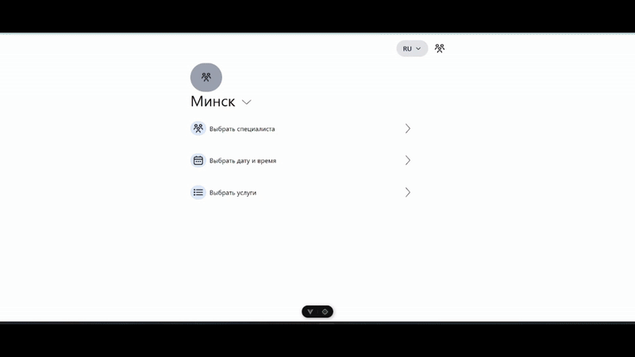

# Barber

Barber Booking App is a web application for booking barber services, built with Vue.js and Pinia. It enables users to select a barber, choose services, pick a date and time, and confirm bookings. The app supports Russian and English languages and includes features for both customers and administrators, such as managing barbers, services, and reviews. Data is stored in localStorage for a lightweight, serverless experience.

Key Features


- Barber Selection: Browse and select barbers, view their profiles, ratings, and reviews.


- Service Selection: Choose from a list of services with details on duration and pricing.


- Calendar and Time Slots: A calendar interface for selecting dates and times (9:00–22:00, hourly) based on barber schedules.


- Booking Confirmation: Enter contact details (email, phone, name) and confirm bookings with validation for required fields.


- Multilingual Support: Russian and English languages via vue-i18n, with language preferences saved in localStorage.


- Review System: Rate barbers (1–5 stars) and leave comments, displayed on their profiles.


- Admin Features:
   - Add, edit, or delete barbers and their schedules.


    - Manage services (name, duration, description, price).

## Project Setup

```sh
npm install
```




